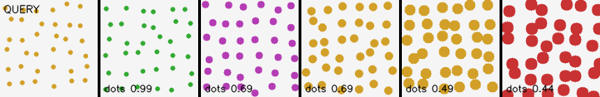
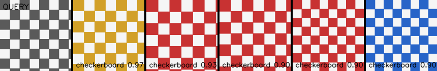
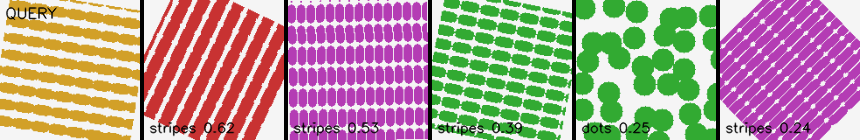
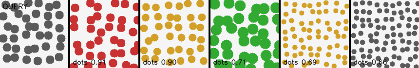

# BoVW Image Similarity Search — Evaluation Report

Leave-one-out evaluation: for every image, query the index (excluding itself) and check whether the retrieved neighbors share its texture category (stripes / dots / checkerboard / crosshatch).

## Precision@K (overall)

| K | Precision |
|---|---|
| 1 | 0.967 |
| 3 | 0.944 |
| 5 | 0.923 |

## Per-category precision@3

| Category | Precision |
|---|---|
| checkerboard | 1.000 |
| crosshatch | 1.000 |
| dots | 0.978 |
| stripes | 0.800 |

## Example queries

**Query category: dots**

**Query category: checkerboard**

**Query category: stripes**

**Query category: dots**

